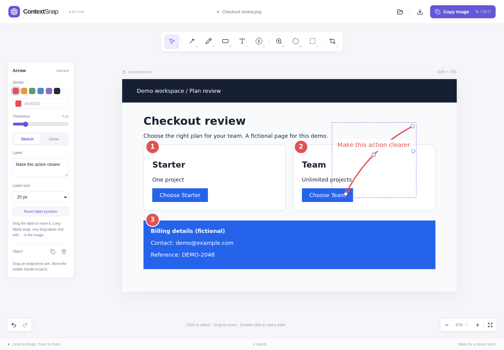
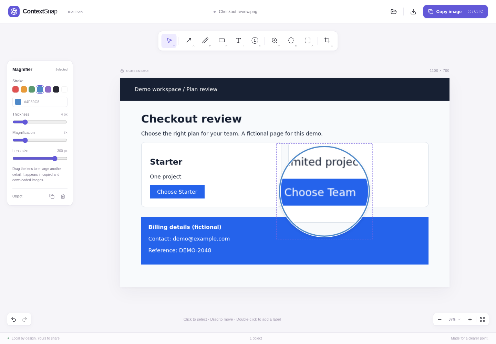
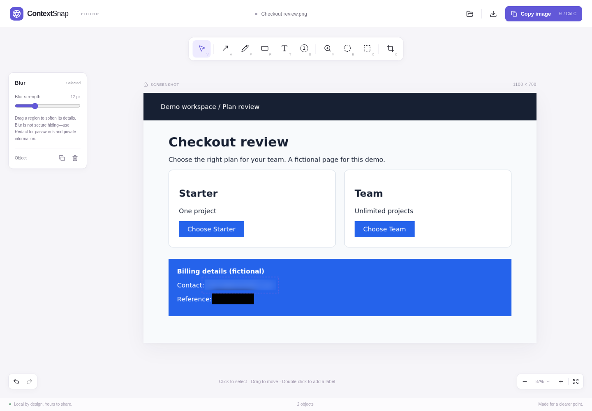
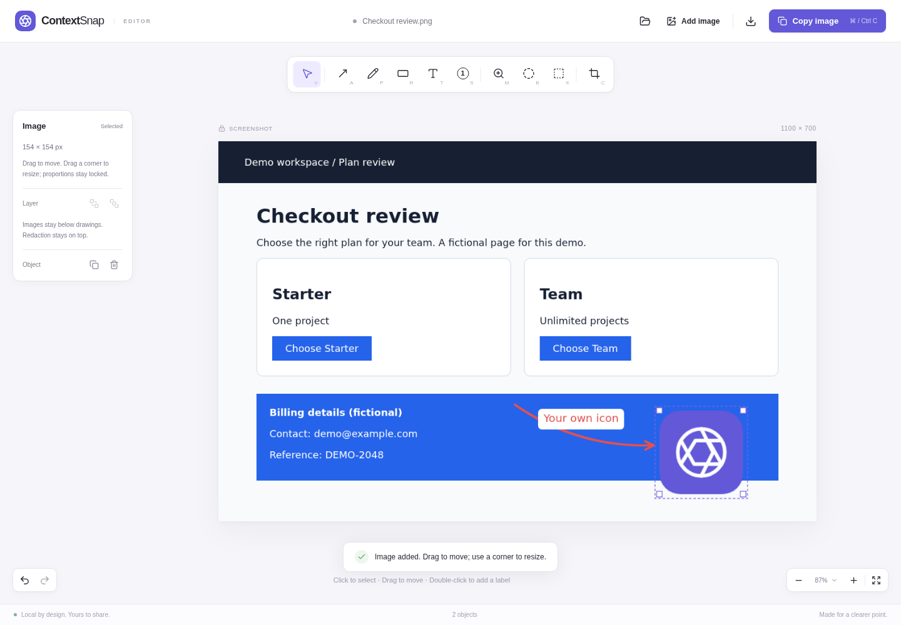
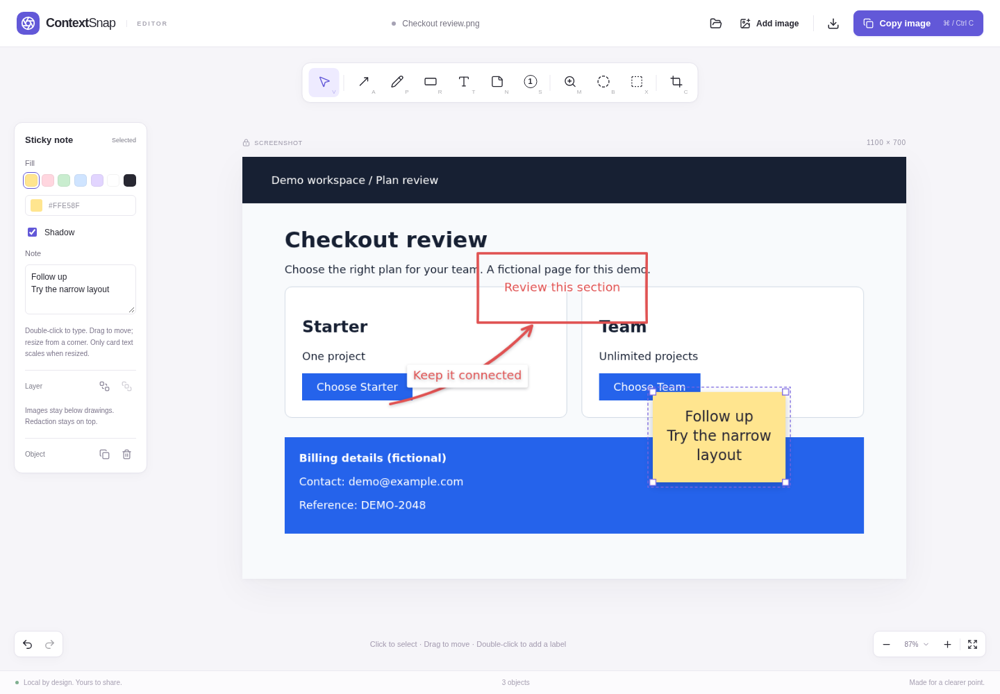
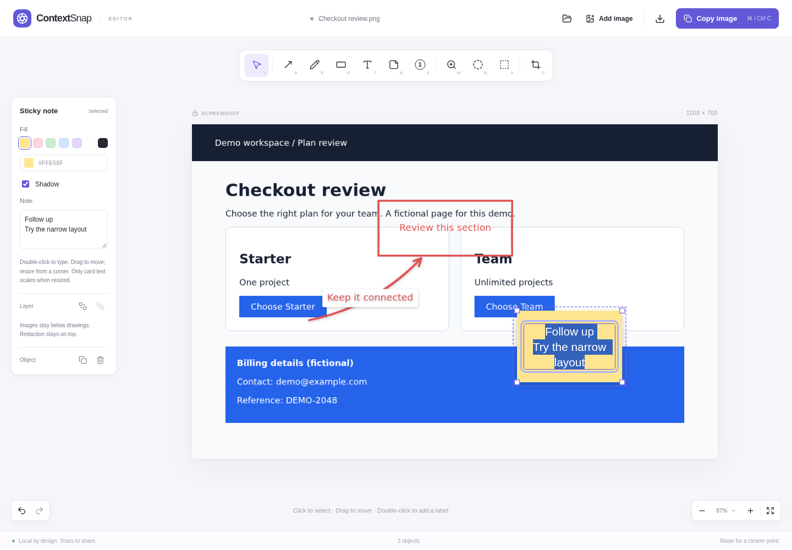

# ContextSnap

A Chrome extension for turning screenshots into clear visual feedback. Capture a page,
draw expressive arrows, and copy the finished image into a chat, issue, or document.
All processing and image storage stay on your device.

[Download for Chrome — v0.2.0](https://github.com/vitqst/vit-contextsnap/releases/download/v0.2.0/contextsnap-0.2.0-chrome.zip)
· [Release notes](https://github.com/vitqst/vit-contextsnap/releases/tag/v0.2.0)
· [MIT license](LICENSE)



## Install in Chrome — no build needed

1. Download [contextsnap-0.2.0-chrome.zip](https://github.com/vitqst/vit-contextsnap/releases/download/v0.2.0/contextsnap-0.2.0-chrome.zip).
   Use this extension ZIP, not GitHub's **Source code** archive.
2. **Unzip** it into a folder you will keep on your computer.
3. Open `chrome://extensions` and enable **Developer mode**.
4. Click **Load unpacked** and select the extracted folder containing `manifest.json`.
5. Pin ContextSnap, open a website, then choose **Select an area** or **Visible page**.
   The screenshot editor opens in a new tab.

Requires Chrome 120 or later. No Node.js, npm, server, API key, or account is needed.
This is a manually installed Chrome MV3 extension, not a Chrome Web Store listing.
Other Chromium browsers are not yet independently tested. A [SHA-256 checksum](https://github.com/vitqst/vit-contextsnap/releases/download/v0.2.0/SHA256SUMS)
is included with the release to verify the ZIP.

## See the released tools in action

### Point clearly with arrows and steps

The editor above shows a curved arrow with an editable label and numbered **1 → 2 → 3**
steps. Choose a sketch or clean stroke, drag endpoints to aim, bend the curve, and move
the label independently. Labels wrap instead of running across the screenshot.

### Enlarge a detail with a circular magnifier

Place a lens on the screenshot, move it to another detail, and adjust its size and
magnification. The enlarged circle is included in your exported image.



### Blur distractions or redact private details

Adjust blur strength for less important content. Use **solid Redact** for secrets:
blur is not secure redaction. Magnifiers respect both effects and cannot reveal masked pixels.



### Copy, paste, and share

Click **Copy image**, then paste the flattened PNG into a chat, issue, or document.
**Download PNG** is always available too. Selection handles and editor controls are
not included in the exported image; flattened exports appear in local Recent history.


These are screenshots of the actual extension using fictional demo content.

### Optional preview — v0.2.0-rc.2

The stable **v0.2.0 download above remains the default**. The optional **v0.2.0-rc.2**
prerelease adds drawing refinements and includes the image-layer and navigation features
from rc.1.

[Preview ZIP](https://github.com/vitqst/vit-contextsnap/releases/download/v0.2.0-rc.2/contextsnap-0.2.0-rc.2-chrome.zip)
· [Preview notes](docs/releases/0.2.0-rc.2.md)
· [Preview SHA256SUMS](https://github.com/vitqst/vit-contextsnap/releases/download/v0.2.0-rc.2/SHA256SUMS)

Use Chrome/Chromium 120 or later and the same unzip and **Load unpacked** instructions
above; other Chromium browsers have not been independently tested. To update an existing
unpacked installation, **copy or download open work first**, replace the files in its
folder with the extracted rc.2 files, then click **Reload** at `chrome://extensions`.
Reopen the editor after updating. If you load the preview from a separate folder, enable
only one ContextSnap version to avoid shortcut conflicts.

These additions are in the RC preview, **not the stable v0.2.0 ZIP**.

#### Image layers and navigation, included from rc.1

- **Back to website** keeps your editor and undo history open. It returns to the original
  capture tab when that tab still shows the captured URL; otherwise it opens the saved URL.
  Recent exports open their saved URL in a new tab. Local imports have no website button.
- **Add image** inserts a local PNG, JPEG, or WebP icon/image as a selected layer. Paste or
  drop into an open editor to add a layer; drop on the screenshot to place it there.
  Drag to move and use a corner handle to resize with proportions locked.
- **Send backward / Bring forward** reorder images among images and drawings among drawings.
  Images stay below drawing annotations. Blur and magnifiers include inserted pixels;
  solid redaction stays on top. Duplicate, delete, nudge, undo, copy, and download work too.

Paste inside text fields remains ordinary text editing. **Open another image** still
replaces the background and asks before discarding unexported work. With no screenshot
open, paste/drop opens an image as the background.



#### Drawing refinements in rc.2



- **Attached arrow labels:** labels sit in a gap at the arrow's midpoint. Dragging a label
  moves the whole arrow. Choose **Straight** or **Curved** for a new or selected arrow;
  switching an existing arrow keeps its endpoints in place. Label font size stays fixed
  when the arrow length changes; long labels wrap.
- **Optional shadows:** one shared **Shadow** toggle controls an arrow and its label;
  sticky cards have their own toggle. Both default on. Switch off for a flat look.
  Other annotations and shape notes remain flat.
- **Notes on shapes:** double-click a rectangle or any other shape to add or edit its note.
  The note moves with its shape; Step notes sit below the circle, or above near the bottom
  edge, keeping the number visible.
- **Sticky notes — N:** place a colored card and type directly on it. Drag to move, use a
  corner to resize, and double-click to edit again. Card text scales with resizing;
  arrow labels and other text do not.
- **Responsive free draw:** supported pens use contact pressure. Mouse input uses drawing
  speed measured over elapsed time—faster strokes get thinner. Adjust **Smoothing**,
  **Pressure influence**, and **Speed influence** for the selected stroke and subsequent
  strokes. Set both influences to zero for constant width.
- **Cleaner extension startup:** removes JavaScript module preload hints that caused
  Chrome's cross-world resource mismatch and unused-preload warnings.



These edits support undo/redo and flattened PNG/clipboard export. Export your work before
closing or reloading the editor; editable objects remain local to the open session.
No new extension permissions are required.

Chrome uses internal version `0.2.0.2` and displays `0.2.0-rc.2`. The numeric version
orders this preview after both the existing stable build and rc.1.

## Released editor tools

The following describes v0.2.0; RC-only additions are listed in the preview section above.

- Visible and area capture, with resize handles, keyboard nudging, and cancellation.
- Locked screenshot background and a compact editor inspired by Excalidraw.
- Lightly sketchy or clean arrows. Drag either endpoint or the middle bend handle;
  double-click an arrow to add a label. Labels wrap, stay within the image/crop, and have
  their own font size. Drag a label or its corner handle to move it; Reset label position
  returns it beside the curve (above, or below when close to the top edge). Very long labels
  are shortened with an ellipsis in the image;
  the full text remains editable in the current session.
- Step circles: click repeatedly for (1), (2), (3); select to edit the number or size.
- Circular magnifier: click to place a lens or drag from its center to set the size;
  move it to enlarge another detail. Adjust its size and magnification in the left panel.
- Blur: drag a region, then adjust strength. Use Redact for sensitive information.
- Pen, rectangle, text, opaque redaction, crop, editor zoom, and 100-step undo/redo.
- Recolor, adjust thickness, move, duplicate, or delete selected objects.
- Copy flattened PNGs directly to the clipboard; download PNG as a fallback.
- Import/paste/drop PNG, JPEG, or WebP files. Importing a new image asks before replacing
  work that has not been copied or downloaded in v0.2.0; see the RC preview above
  for the new layer workflow.
- Recent exports in the popup, with individual removal and Clear all.

The approved scope is documented in [the design](docs/plans/2026-09-15-screenshot-editor-design.md).
The [original requirements](docs/spec/20260915-init-requirement.md) remain the longer-term
backlog. Live-page annotations/text output, full-page capture, localization, and Web Store
publication are deferred. Pressure/speed brush controls are part of the rc.2 preview above.

## Shortcuts

| Action                                                  | Shortcut                                    |
| ------------------------------------------------------- | ------------------------------------------- |
| Open popup                                              | Alt+Shift+S                                 |
| Select area                                             | Ctrl+Shift+1 (Cmd+Shift+1 on macOS)         |
| Capture visible page                                    | Alt+Shift+V                                 |
| Select / Arrow / Pen / Rectangle / Text / Redact / Crop | V / A / P / R / T / X / C                   |
| Step / Magnifier / Blur                                 | S / M / B                                   |
| Sticky note (rc.2 preview)                              | N                                           |
| Straight arrow or square rectangle                      | Hold Shift while drawing                    |
| Undo / Redo                                             | Ctrl+Z / Ctrl+Shift+Z (Cmd on macOS)        |
| Copy image                                              | Ctrl+C (Cmd on macOS)                       |
| Finish inline text                                      | Ctrl+Enter (Cmd on macOS), or click outside |
| Delete selected object                                  | Delete or Backspace                         |
| Duplicate selected object                               | Ctrl+D (Cmd on macOS)                       |
| Move selected object                                    | Arrow keys; hold Shift for 10 pixels        |
| Fit to screen                                           | Ctrl+0 (Cmd on macOS)                       |
| Zoom                                                    | Ctrl/Cmd+scroll or zoom buttons             |
| Cancel gesture / exit area selection                    | Escape                                      |

On macOS, extension shortcuts use Option instead of Alt. Browser or OS shortcuts can
conflict; change extension shortcuts at `chrome://extensions/shortcuts`.

## Privacy and data lifetime

- No telemetry, remote fonts, network services, or automatic uploads.
- Captures include visible page content; passwords and personal information are not
  automatically detected or excluded. Check your screenshot before sharing it.
- Capturing runs only after an explicit extension action. Area-selection UI is removed
  after confirmation or cancellation; there is no always-on content script.
- Temporary original captures are held in extension IndexedDB for handoff, then consumed
  when the editor opens. At most five abandoned captures are retained for up to an hour
  and pruned on the next storage operation. Editor originals and undo history live in RAM.
- Recent stores **only flattened exported images**, capped at 20 images and a shared
  100 MB storage budget. It retains the originating title, full URL (including query and
  fragment), and capture time locally. URLs may contain sensitive information too.
- Redact paints solid black into exported pixels. Original source pixels and drawing
  objects are never embedded in exported PNGs. Undo can restore the original while the
  current editor is open; it cannot restore it from a flattened Recent export.
- Blur softens details but is **not secure redaction**. Magnifiers sample the blurred/
  redacted screenshot, regardless of tool creation order. Solid redaction stays above
  magnifiers, so adding a lens cannot uncover masked source details.
- Copy and Download export the current canvas crop without selection handles or UI.
  Closing/reloading the editor discards its editable session; copy or download first.
- In the RC preview's layer workflow, inserted images stay in memory for the current
  session, including undo/redo. Duplicates share the same decoded asset. Replacing the
  screenshot or closing the editor releases those assets; Recent still stores only flattened PNGs.
- Back to website is an explicit navigation action. It may open the locally saved full URL,
  including its query/fragment, using ordinary browser navigation. No extra permissions,
  background URL fetching, or browsing-history collection are added.
- Removing the extension clears its local data. Browser storage can also be evicted;
  download anything you need to keep permanently.

## Development and verification

To build from source, use Node.js 22.12+, 24, or 26+:

```sh
git clone https://github.com/vitqst/vit-contextsnap.git
cd vit-contextsnap
npm ci
npm run build
```

Load `.output/chrome-mv3` at `chrome://extensions` using **Load unpacked**.

```sh
npm run dev           # WXT development extension
npm run check         # TypeScript, ESLint, formatting, unit tests, production build
npx playwright install chromium
npm run test:e2e      # Packaged-extension editor checks in isolated Chromium
npm run zip           # Chrome ZIP package in .output/
```

See [browser verification](tests/README.md) for the full suite, including actual Chrome
capture through native shortcuts. Tests use disposable profiles, never your normal
browser. The CI workflow runs the complete Linux capture suite.

### Code layout

```text
entrypoints/       Chrome background, on-demand area script, popup/editor HTML
src/core/          Versioned object model, geometry, immutable history
src/editor/        Canvas renderer, pointer handling, React editor and controls
src/export/        Flattening, clipboard, PNG download, image size limits
src/platform/      Chrome APIs, capture authority, pixel cropping, IndexedDB
src/popup/         Capture actions and local Recent list
src/ui/            Shared controls, brand and design tokens
tests/            Browser tests and deterministic local fixture pages
```

Coordinates stay in source-image pixels; editor zoom is a separate CSS transform.
Arrow seeds are fixed per object. The canvas renderer is shared by preview and export,
while selection is rendered in a separate overlay. WXT owns extension bundling;
Rough.js and perfect-freehand own stroke primitives.

To add a drawing tool, extend the discriminated object union, pure geometry and renderer,
then add its interaction and control. Cover geometry with unit tests and validate exported
pixels in the browser. Do not put Chrome API calls inside geometry or renderer modules.

To update the toolbar artwork, edit `public/icon.svg` then run
`node scripts/generate-icons.mjs` (requires the Playwright Chromium installed above).
To refresh the README screenshots after a build, run `node scripts/capture-readme.mjs`.
It operates the real editor in a disposable browser using a fictional local fixture;
the generated PNGs live in `docs/images/` and are not included in the extension ZIP.
Use `node scripts/capture-readme.mjs --image-layers` to refresh only the RC preview's
image-layer example without replacing the v0.2.0 screenshots.

## Limits

Capture supports ordinary HTTP/HTTPS pages. Chrome settings, extension pages, the Chrome
Web Store, and file URLs show an explicit unsupported message. Images are limited to
32 megapixels and 16,384 pixels per side. Imported files are limited to 50 MB.
Very large or corrupt images report errors. Clipboard failures leave the editor usable
with Download PNG available. Local editing is intended for desktop-sized windows.
The RC preview's image-layer workflow allows 20 MB per inserted file and 16 megapixels of
inserted assets per session, including undo history. Deleting a layer keeps its asset available
for undo; start a new screenshot to release the budget. SVG, image URL fetching, and
editable-layer persistence are not supported. Animated PNG/WebP inputs become a single still frame.

## Contributing and security

Read [CONTRIBUTING.md](CONTRIBUTING.md) for setup, verification, and design boundaries.
Use [GitHub issues](https://github.com/vitqst/vit-contextsnap/issues) for bugs and focused
feature proposals. Follow [SECURITY.md](SECURITY.md) for private vulnerability reports;
never upload real secrets or private screenshots in public issues or test artifacts.

## License and acknowledgments

ContextSnap is available under the [MIT license](LICENSE). Bundled dependencies retain
their own licenses; see [third-party notices](THIRD_PARTY_NOTICES.md). Builds and ZIPs
include both license files. `private: true` in `package.json` only prevents accidental
npm publication; it does not restrict use of this public source repository.

The editor interaction is inspired by Excalidraw. ContextSnap is an independent project,
not affiliated with or endorsed by Excalidraw or Google. It is not published in the
Chrome Web Store yet.
